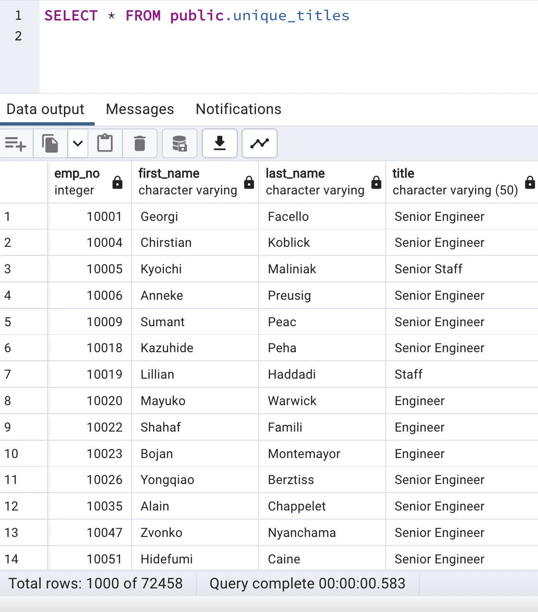
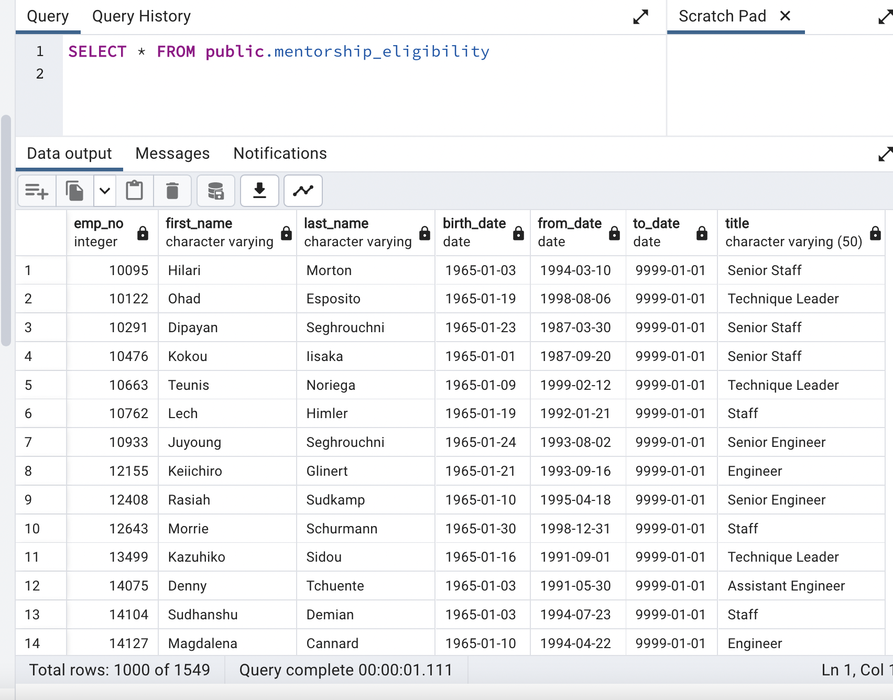
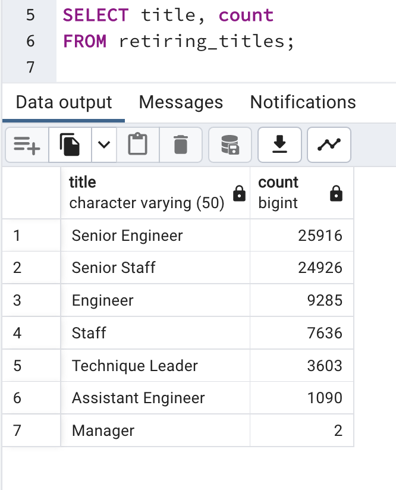
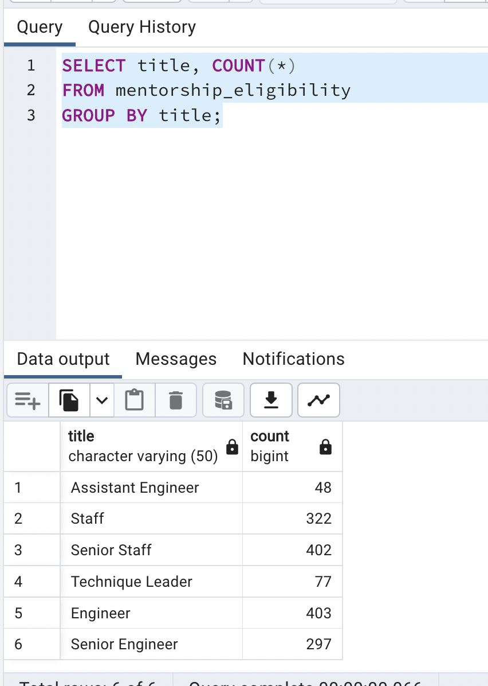

# Pewlett-Hackard-Analysis
## Overview

The purpose of this analysis is determine the number of employees retiring by title, and determine the employees eligible to participate in a mentorship program.

## Results

The results of this analysis show that a large number of employees retiring. There are four major points that need to be addressed.

* 72,458 employees are eligible for retirement.
* 7 different titles will have retirements.
* Senior positions make up a majority of those retiring.
* 1549 employees are eligible to participate in mentorship program.

## Summary
The chart below shows the breakdown of employees retiring by their title. Of the 72,458 retiring, ~36% are Senior Engeneers, ~34% are Senior Staff, ~13% are Engeneers, ~11% are Staff, ~5% are Technique Leaders, ~2% are Assistant Engineers, and the Managers are minimal in the total count. If all these positions are necessary, Pewlett-Hackard will be hiring a lot  of new employees in the near future. 

As shown in the table below, if mentorship is needed to be one on one, there are not nearly enough mentors to re staff Pewlett-Hackard. Even if each mentor takes on a much larger amount of new hires, there might not be enough. It might be possible to increase these numbers if, instead of having the birth year as a prerequisite, they included younger employees with adequate work experience. With the amount of new hires so high, the need for more mentors is necessary.

